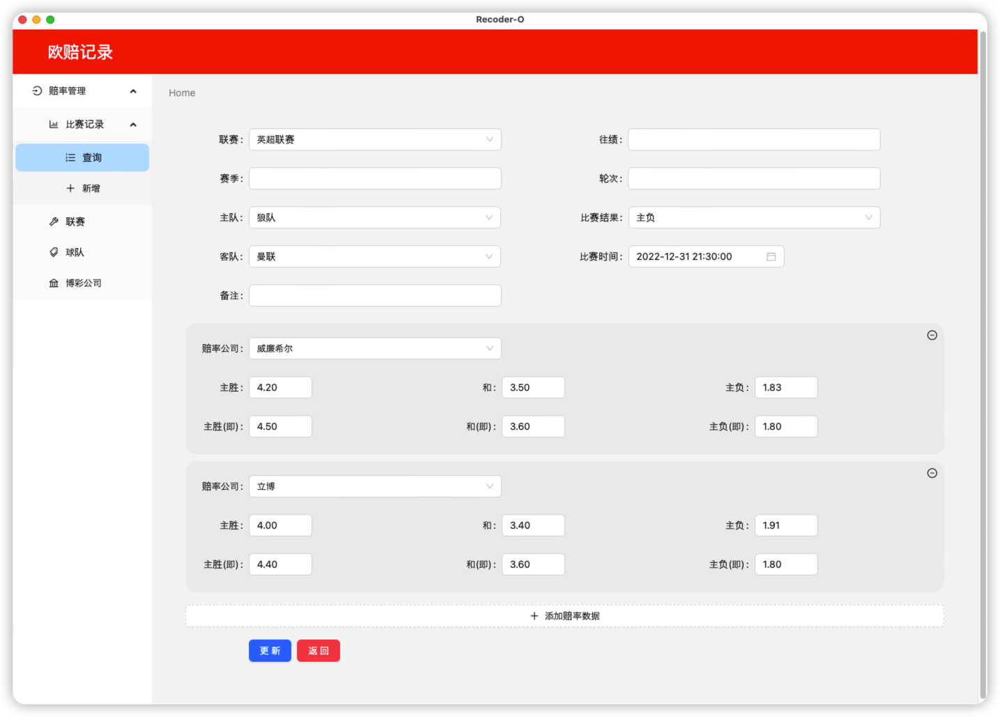

# Rcorder-O

a tool of record european odds for predict the result of soccer games




## Stack

1. Tauri for build desktop app
2. Rust for serives and db handle
3. antd for UI style and components
4. sqlx for DB connection

## How to use it

1. run the migrations file to build postgresql db

```bash
-- if use the sqlx
sqlx migrate run

-- revert
sqlx migrate revert
```

2. run the command with the below

```bash
-- develop
cargo tauri dev


-- build
cargo tauri build
```

Have fun with this crate!

## License

This project is distributed under the terms of AGPL-3.0.

See [LICENSE](https://github.com/wangxinyang/europe-odds-analyze/blob/main/License) for details.

Copyright 2023 Xinyang Wang
