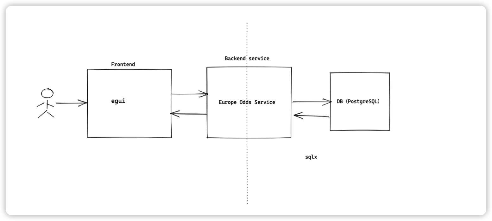

# Feature

- Feature Name: (europe_odds_service)
- Start Date: (2022-12-12)

## Summary

a european odds service for persisting and analyzing odds data. the serive should provide a way to persist odds data and provide a way to analyze the data. the service should be able to be used by other services to provide odds data to users.

## Motivation

european odds of scoccer shows the result of game. logging the odds data will help to analyze the data and predict the result of the game.

## Guide-level explanation

Basic architecture:

Main services:

- add odds data about several european leagues type to the database
- add odds bookmaker to the database
- add odds data of game to the database
- update odds data in the database
- query odds data from the database by several condfitions(league type, years, odds bookmaker etc)

## Reference-level explanation

N/A

## Drawbacks

N/A

## Rationale and alternatives

N/A

## Prior art

N/A

## Unresolved questions

- What parts of the design do you expect to resolve through the RFC process before this gets merged?
- What parts of the design do you expect to resolve through the implementation of this feature before stabilization?
- What related issues do you consider out of scope for this RFC that could be addressed in the future independently of the solution that comes out of this RFC?

## Future possibilities

TBD
